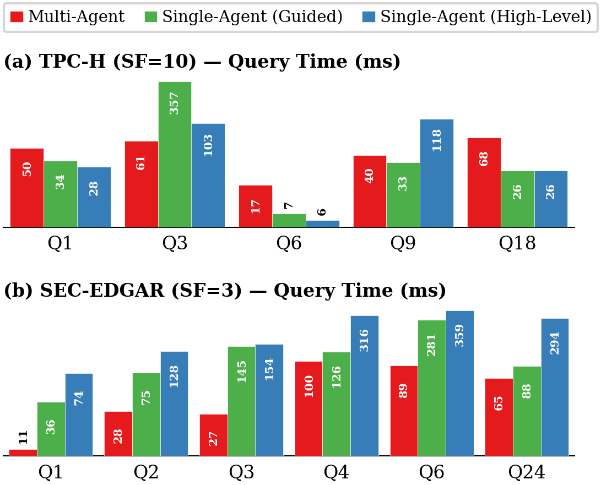

# GenDB: Generative Database System

An LLM-powered agentic system that generates customized database execution code for user-provided SQL workloads — no pre-built DBMS required.

## Overview

GenDB takes a different approach to query execution: instead of routing queries through a general-purpose DBMS, it uses a team of LLM agents to analyze your specific SQL workload and database, then generates tailored C++ execution code optimized for that exact use case. The input is a SQL workload and dataset; the output is a standalone, high-performance execution engine specialized to your needs.

## Key Ideas

- **Workload-specific code generation** — generate execution code tuned to the actual queries and data, not a one-size-fits-all engine
- **Three operating modes** — multi-agent default (5-agent), multi-agent skills (7-agent, `--use-skills`), and single-agent (one LLM handles the entire pipeline end-to-end)
- **Adaptive thinking** — each agent has structured thinking discipline (concise, phase-based reasoning) with configurable effort levels and model escalation (Sonnet → Opus) on correctness failures
- **Plan-first pipeline** — Query Planner designs lean JSON execution plans, Code Generator implements them, Optimizer can modify both plan and code
- **MVCC-style column versions** — optimizer can build derived column representations at storage level, breaking optimization ceilings caused by initial encoding choices
- **Multi-run execution** — each query runs 3 times per iteration in either hot mode (all cached) or cold mode (OS cache cleared before each run)
- **Adaptive iteration budget** — stall detection, correctness caps, competitive baseline checks, and model escalation drive when to stop or intensify optimization
- **True per-query pipelining** — each query flows independently through its pipeline stages, gated by semaphore for LLM calls and serialized for execution

## Operating Modes

### Default Mode (no skills, 5 agents)

The default mode (`useSkills: false`, `useDba: false`) uses a lean 5-agent pipeline. Agents rely solely on their identity prompts, query guides, and LLM reasoning — no external skills or knowledge base.

```
Phase 1: Workload Analyzer → Storage/Index Designer → Per-Query Guides (Qi_guide.md)
Phase 2: Query Planner → Code Generator → Execute → [Optimizer → Execute]*
```

Agents in default mode: Workload Analyzer, Storage Designer, Query Planner, Code Generator, Query Optimizer.

Code Inspector and DBA are **skipped**. The `Skill` tool is removed from agents' allowed tools.

### Skills Mode (`--use-skills`, 7 agents)

Skills mode adds the Code Inspector and DBA agents, and loads domain skills via the Claude Code skill system.

```
Phase 1: Workload Analyzer → Storage/Index Designer → [DBA Stage A] → Per-Query Guides
Phase 2: Query Planner → Code Generator → Inspector → Execute → [Optimizer → Inspector → Execute]*
Phase 3: DBA Stage B → Retrospective + experience evolution
```

Each agent gets a 4-layer prompt: (1) identity prompt, (2) experience skill (always loaded), (3) domain skills (loaded on demand), (4) user prompt (task context via templates).

Enable with: `--use-skills` (and optionally `--dba-stage-a` for DBA Stage A).

### Single-Agent Mode

A single LLM agent handles the entire pipeline — analysis, storage design, code generation, and optimization — in one session. This enables comparing multi-agent vs single-agent performance.

```
Single Agent: Analyze → Data Preparation → Implement Queries → Optimize
```

Two prompt variants:
- **high-level** — minimal guidance: just I/O contracts and hard constraints, full freedom in approach
- **guided** — adds a suggested 4-phase workflow (Analyze → Data Prep → Implement → Optimize)

Key constraints:
- Sandbox rule: agent may only access explicitly provided paths (no reuse of prior runs)
- No precomputed results: gendb storage may only contain data-level transformations (encoding, indexes, sorting), not query-specific intermediates
- Per-iteration recording: `execution_results.json` with `timing_ms` and `validation.status`
- Real-time progress monitoring via Claude Agent SDK streaming

## Performance

### GenDB vs Baselines

#### TPC-H SF10


#### SEC-EDGAR (3 Years, 5GB)


### GenDB Version Comparison




## Agents

| Agent | Default Mode | Skills Mode | Role |
|-------|-------------|-------------|------|
| **Workload Analyzer** | Yes | Yes | Parse SQL workload, detect hardware, sample data |
| **Storage Designer** | Yes | Yes | Design storage/indexes, generate + run ingestion, per-query guides |
| **DBA** | No | Yes | Pre-gen risk analysis (Stage A), post-run retrospective + experience evolution (Stage B) |
| **Query Planner** | Yes | Yes | Design lean JSON execution plan |
| **Code Generator** | Yes | Yes | Implement plan in C++, compile + run + validate |
| **Code Inspector** | No | Yes | Review code against experience skill + Query Guide |
| **Query Optimizer** | Yes | Yes | Targeted edits to plan/code; can build derived column versions |

All agents use Sonnet by default. On repeated correctness failures, the orchestrator escalates to Opus.

## Skills (Skills Mode Only)

Domain skills (`.claude/skills/`) are loaded selectively per query and agent:

| Skill | Purpose |
|-------|---------|
| `experience` | Always loaded. Correctness + performance rules with frequency/severity. |
| `data-structures` | When to use hash tables vs bloom filters vs direct arrays vs sorted arrays |
| `join-optimization` | Join strategies, pre-built index usage, sampling |
| `scan-optimization` | Predicate pushdown, late materialization, zone maps |
| `aggregation-optimization` | Hash/sorted/parallel aggregation patterns |
| `hash-tables` | Open-addressing, Robin Hood, bounded probing templates |
| `data-loading` | mmap, madvise, cold/hot I/O tradeoffs |
| `indexing` | Zone maps, hash indexes, construction guidelines |
| `parallelism` | Morsel-driven, OpenMP, SIMD, thread-local patterns |
| `gendb-storage-format` | Binary column format, type mappings, encodings |
| `gendb-code-patterns` | File structure, GENDB_PHASE, mmap pattern, compilation |
| `research-papers` | 30+ seminal paper references by topic |

## Project Structure

```
src/gendb/
  orchestrator.mjs          # Multi-agent pipeline orchestration
  single.mjs                # Single-agent mode entry point
  shared.mjs                # Shared utilities (runAgent via Agent SDK, template rendering, etc.)
  config.mjs                # Configuration loader
  gendb.config.mjs          # Hyperparameters (models, timeouts, effort levels)
  agents/                   # 7 multi-agent + 1 single-agent (prompt.md + index.mjs each)
  utils/                    # System utilities (date_utils.h, timing_utils.h, paths.mjs)
  tools/                    # compare_results.py and other tooling

.claude/skills/             # Domain skills (used in skills mode)

benchmarks/
  tpc-h/                    # TPC-H benchmark (queries, results, ground truth)
  sec-edgar/                # SEC-EDGAR financial statements benchmark

output/<workload>/<timestamp>/  # Per-run output with iteration history
```

## Usage

```bash
# Multi-agent default mode (5-agent, no skills)
node src/gendb/orchestrator.mjs --benchmark tpc-h --sf 10

# Multi-agent skills mode (7-agent, with domain skills + Code Inspector + DBA)
node src/gendb/orchestrator.mjs --benchmark tpc-h --sf 10 --use-skills

# Single-agent mode (high-level prompt)
node src/gendb/single.mjs --benchmark tpc-h --sf 10 --single-agent-prompt high-level

# Single-agent mode (guided prompt)
node src/gendb/single.mjs --benchmark sec-edgar --sf 3 --single-agent-prompt guided

# Run all benchmarks (single-agent + multi-agent)
bash run_benchmarks.sh

# Hot optimization (default), cold optimization
node src/gendb/orchestrator.mjs --benchmark tpc-h --optimization-target hot

# Control optimization iterations and concurrency
node src/gendb/orchestrator.mjs --max-iterations 5 --stall-threshold 5 --max-concurrent 22
```
