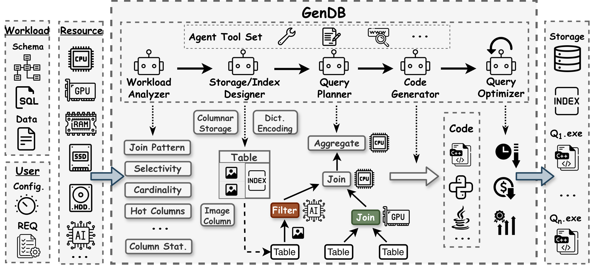
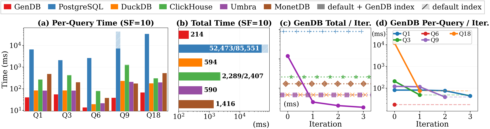
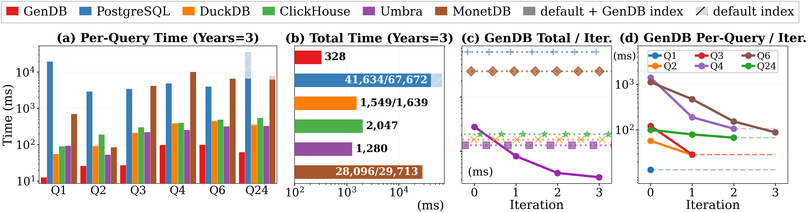
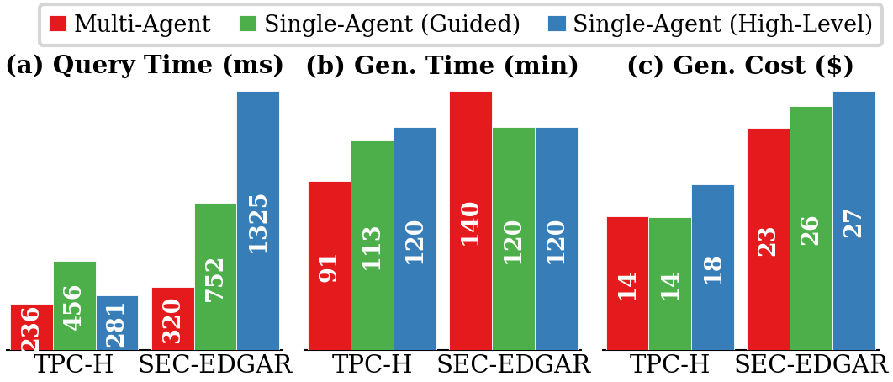

# GenDB: An LLM-Powered Generative Query Engine

**Instance-optimized query execution code generation tailored to your specific data, workloads, and hardware.**

> **2.8x** faster than DuckDB and Umbra on TPC-H &nbsp;|&nbsp; **5.0x** faster than DuckDB on real-world financial data &nbsp;

<p align="center">
  
</p>

**Input:** database schema, SQL queries, data files, hardware specs, and user configurations (optimization targets, iteration budgets). **Pipeline:** five specialized LLM agents — Workload Analyzer, Storage/Index Designer, Query Planner, Code Generator, and Query Optimizer — each equipped with tools for file I/O, terminal access, and web search, collaborating through structured JSON. **Output:** optimized storage structures, indexes, and one standalone executable per query — all tailored to the specific data, workload, and hardware.

## Why Generate?

Consider PostgreSQL. Since its origins as an OLTP database, the community has built extensions for nearly every emerging use case: PostGIS for geospatial, TimescaleDB for time-series, pgvector for embeddings, Citus for distributed analytics, pg_duckdb for OLAP, AGE for graph queries, and [hundreds more](https://pigsty.io/blog/pg/pg-eat-db-world/). In parallel, entirely new systems were purpose-built for each domain: DuckDB, ClickHouse, and Umbra for OLAP; Milvus and Pinecone for vector search; InfluxDB for time-series; Neo4j for graph; Snowflake and BigQuery for cloud analytics.

Each extension is [difficult](https://www.vldb.org/pvldb/vol18/p1962-kim.pdf) and fights the host system's architectural constraints :weary:. Each new system requires years of engineering :wrench: and significant monetary costs :moneybag:. And with every emerging technique — multimodal AI operators, GPU-native analytics, learned indexes — the cycle repeats :tired_face:.

**But actually there is a third option:** use LLMs to **generate per-query execution code**.

- **Performance** — Instance-optimized code exploits exact data distributions, group cardinalities, join selectivities, and cache topology. No general-purpose engine can match this.
- **Extensibility** — Integrating new techniques requires *prompting*, not re-engineering a complex codebase.
- **Economics** — In production, [80% of queries repeat in 50% of clusters](https://www.vldb.org/pvldb/vol17/p3694-saxena.pdf), and long-running queries almost always recur as they correspond to regular transformation or analytical tasks. Generation cost is amortized over many executions.

## Current Landscape

[Paper](https://arxiv.org/pdf/2603.02081)

Currently, GenDB is implemented with Claude Code Agent as the underlying component in the multi-agent system, and evaluated on OLAP workloads (TPC-H, SEC-EDGAR). For developers, it automatically generates instance-optimized execution code whose correctness can be verified by manual inspection. For users without an SQL background, GenDB can be extended with a natural language interface, similar to conversational analytics services already deployed in production.

**When to use GenDB today.** GenDB is well suited for recurring workloads where upfront generation cost pays off over many executions. For ad-hoc queries, GenDB can be combined with a traditional DBMS in a hybrid architecture: the traditional system handles one-off queries, while GenDB accelerates frequent ones. As LLMs become faster and cheaper, we expect the generation overhead to shrink — the long-term target is per-query generation in seconds at minimal cost, making the hybrid boundary increasingly irrelevant.

**What's next.** We are actively developing and will continually update GenDB with support for more scenarios:

- **Semantic queries** — Generate code for multimodal data (images, audio, text) with AI-powered operators, moving beyond SQL's relational model
- **GPU-native generation** — Generate CUDA/GPU code targeting libcudf and cost-efficient GPU analytics, not just CPU
- **Self-evolving system** — Learn from past runs, accumulate optimization experience, improve generation quality over time
- **Reusable generation** — Share operators across queries, generate for query templates, reduce per-query generation cost

## Results

We evaluate on two benchmarks: **TPC-H**, a widely-used OLAP benchmark whose queries and optimization strategies are well-represented in LLM training data, and **SEC-EDGAR**, a new benchmark we constructed from real-world SEC financial filings. SEC-EDGAR serves as an unseen workload — its schemas and query patterns have rarely appeared in training corpora — to test whether GenDB generalizes beyond memorized optimizations.

**All engines are configured to use comparable hardware resources, and parallelism is fully enabled to ensure each system can fully demonstrate its performance. To ensure fair comparison, result or intermediate result caching, or pre-computed derived columns, are not allowed in GenDB.** GenDB outperforms all baselines on every query in both benchmarks.

| | GenDB | DuckDB | Umbra | ClickHouse | MonetDB | PostgreSQL |
|---|---|---|---|---|---|---|
| **TPC-H** | **214 ms** | 594 ms | 590 ms | 2,289 ms | 1,416 ms | 52,473 ms |
| **SEC-EDGAR** | **328 ms** | 1,549 ms | 1,280 ms | 2,047 ms | 28,096 ms | 41,634 ms |

**TPC-H (SF10):** 2.8x faster than DuckDB/Umbra. Up to 6.1x on complex multi-way joins (Q9). 11.2x faster than ClickHouse.

**SEC-EDGAR (5GB financial data):** 5.0x faster than DuckDB, 3.9x faster than Umbra. The performance gap widens on this unseen benchmark, confirming that GenDB's advantage comes from instance-level optimization rather than memorized strategies.

#### TPC-H SF10


#### SEC-EDGAR (3 Years, 5GB)


#### Ablation: Multi-Agent vs Single-Agent

| | Multi-Agent | Single (Guided) | Single (High-Level) |
|---|---|---|---|
| **TPC-H** | **236 ms** | 456 ms (1.9x slower) | 281 ms (1.2x slower) |
| **SEC-EDGAR** | **320 ms** | 752 ms (2.3x slower) | 1,325 ms (4.1x slower) |

The gap widens on unseen workloads (SEC-EDGAR), where structured multi-agent decomposition generalizes better. Multi-agent also costs less ($14.15 vs $17.54 on TPC-H).



## How It Works

Five specialized LLM agents collaborate through a structured pipeline:

1. **Workload Analyzer** — Profiles hardware (cache hierarchy, cores, SIMD), samples data, extracts workload characteristics (join patterns, selectivity, group cardinalities)
2. **Storage/Index Designer** — Designs and builds optimized storage layouts with encoding, compression, and indexes (zone maps, hash indexes, bloom filters)
3. **Query Planner** — Generates resource-aware execution plans adapted to data and hardware
4. **Code Generator** — Implements the plan as optimized native code with system-level optimizations (memory-mapped I/O, SIMD, parallelism)
5. **Query Optimizer** — Iteratively refines code using runtime feedback (TPC-H Q18: 12s to 74ms in one iteration — **163x**)

**Instance-optimized code in action** — As one example of many possible optimizations, consider how GenDB adapts aggregation strategy based on group cardinality and cache topology. A general-purpose engine uses the same hash aggregation for every query. GenDB reasons about the specific workload and hardware (in this case: 32KB L1 / 1MB L2 / 44MB shared L3, 64 cores) to generate fundamentally different code:

**TPC-H Q1 — 6 groups (fits in L1):** The query aggregates `lineitem` by `returnflag` and `linestatus`, producing only 6 groups. GenDB skips hashing entirely — each thread uses a direct array of 6 accumulators (384 bytes), fitting comfortably in the 32KB L1 cache.
```cpp
// TPC-H Q1: 6 groups × 64B = 384B per thread → fits in 32KB L1
struct alignas(64) Accum { int64_t cnt, sum_qty, sum_price, ...; };
std::array<Accum, 6> local;  // per-thread, no hashing needed
int g = returnflag[i] * 2 + linestatus[i];  // direct index
local[g].cnt++;
local[g].sum_price += price[i];
```

**TPC-H Q3 — 4M groups (needs L3-aware design):** The query joins `customer`, `orders`, and `lineitem` and groups by `orderkey` — producing ~4M distinct groups. Per-thread hash tables would consume ~3GB across 64 threads, far exceeding the 44MB shared L3. GenDB uses a single shared hash table with column-separated layout: keys (16MB) and values (32MB) in separate arrays so probes only touch keys (L3 hit). Lock-free CAS eliminates both locks and a merge phase.
```cpp
// TPC-H Q3: 4M groups, shared table — keys and values separated
int32_t oa_keys[4194304];  // 4M × 4B = 16MB → fits in 44MB L3
double  oa_rev[4194304];   // 4M × 8B = 32MB
uint64_t slot = oa_probe(oa_keys, orderkey);
atomic_add_double(&oa_rev[slot], revenue);  // 64 threads, lock-free CAS
```

This is just one dimension of instance optimization. GenDB similarly adapts join strategies, scan/filter techniques, storage layouts, index selection, and parallelism patterns based on the specific data and hardware characteristics of each query.

## Quick Start

### Prerequisites

- **Node.js 18+** and npm
- **g++** with C++17 and OpenMP support (`sudo apt-get install build-essential`)
- **Claude access** — either `export ANTHROPIC_API_KEY=your_key`, or log in to [Claude Code](https://docs.anthropic.com/en/docs/claude-code) with a Pro/Max/Team/Enterprise subscription plan

### Setup

```bash
# One-command setup: checks prerequisites, installs dependencies, downloads data
bash scripts/setup.sh

# Or customize data scale:
bash scripts/setup.sh --sf 10 --years 3    # TPC-H SF10 (~10GB) + SEC-EDGAR 3 years (~5GB)
bash scripts/setup.sh --skip-data           # Dependencies only, download data later
```

To download data separately:
```bash
bash benchmarks/tpc-h/setup_data.sh 10       # TPC-H at scale factor 10
bash benchmarks/sec-edgar/setup_data.sh 3     # SEC-EDGAR, 3 years (2022-2024)
```

### Operating Modes

GenDB supports four operating modes:

- **Multi-Agent (5 agents)** — Five specialized agents collaborate through a structured pipeline with JSON-based inter-agent communication. Default and best-performing mode. *This is the version used in paper experiments.*
- **Multi-Agent with Skills (7 agents)** — Extends the pipeline with a Code Inspector and DBA agent, each loading curated domain knowledge (join optimization, parallelism patterns, hash table design).
- **Single-Agent Guided** — One agent handles everything end-to-end, with a suggested 4-phase workflow and domain hints.
- **Single-Agent High-Level** — Minimal guidance: only I/O contracts and hard constraints, full freedom in approach.

All modes support `--optimization-target hot` (optimize for cached/warm runs, default) or `--optimization-target cold` (optimize for cold runs with OS cache cleared before each execution).

```bash
# Multi-agent (5 agents, default)
node src/gendb/orchestrator.mjs --benchmark tpc-h --sf 10

# Multi-agent with domain skills (7 agents)
node src/gendb/orchestrator.mjs --benchmark tpc-h --sf 10 --use-skills

# Single-agent guided
node src/gendb/single.mjs --benchmark tpc-h --sf 10 --single-agent-prompt guided

# Run all benchmarks
bash scripts/run_benchmarks.sh
```

## Project Structure

```
src/gendb/
  orchestrator.mjs          # Multi-agent pipeline orchestration
  single.mjs                # Single-agent mode entry point
  shared.mjs                # Shared utilities (runAgent, templates, Agent SDK)
  gendb.config.mjs          # Configuration (models, timeouts, iteration limits)
  agents/                   # Agent prompts and logic
    workload-analyzer/      #   Workload & hardware profiling
    storage-index-designer/ #   Storage layout & index design
    query-planner/          #   Execution plan generation
    code-generator/         #   Native code generation
    query-optimizer/        #   Iterative optimization
    code-inspector/         #   Code review (skills mode)
    dba/                    #   DBA analysis (skills mode)
    single-agent/           #   Single-agent prompts
  tools/                    # Result comparison utilities
  utils/                    # C++ utility headers (mmap, hashing, timing, dates)

benchmarks/
  tpc-h/                    # TPC-H benchmark (queries, data, ground truth, baselines)
  sec-edgar/                # SEC-EDGAR benchmark (queries, data, ground truth, baselines)
  lib/                      # Benchmark runner, plotting, system configs
  figures/                  # Generated benchmark result figures

scripts/
  setup.sh                  # Environment setup (prerequisites, dependencies, data)
  run_benchmarks.sh         # Run all benchmark configurations

.claude/skills/             # Domain skills (12 skills: join optimization, parallelism, etc.)
assets/                     # Project figures
output/                     # GenDB run outputs (per benchmark, per timestamp)
```

## Citation

```bibtex
@misc{lao2026gendbgenerationqueryprocessing,
      title={GenDB: The Next Generation of Query Processing -- Synthesized, Not Engineered}, 
      author={Jiale Lao and Immanuel Trummer},
      year={2026},
      eprint={2603.02081},
      archivePrefix={arXiv},
      primaryClass={cs.DB},
      url={https://arxiv.org/abs/2603.02081}, 
}
```
