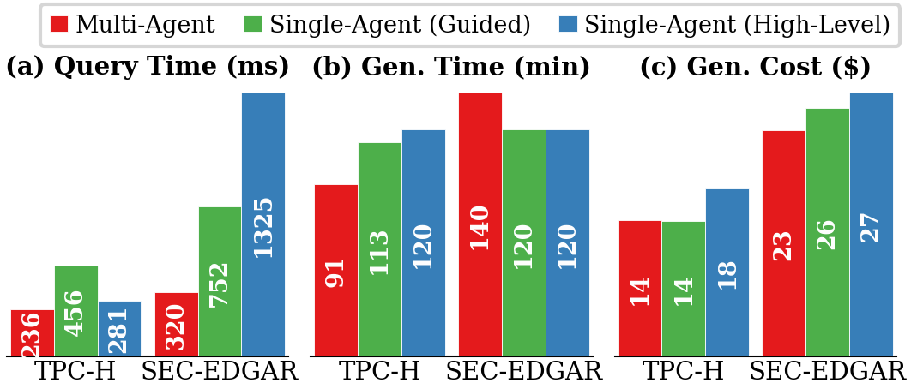

## Ablation: Multi-Agent vs Single-Agent

| | Multi-Agent | Single (Guided) | Single (High-Level) |
|---|---|---|---|
| **TPC-H** | **236 ms** | 456 ms (1.9x slower) | 281 ms (1.2x slower) |
| **SEC-EDGAR** | **320 ms** | 752 ms (2.3x slower) | 1,325 ms (4.1x slower) |

The gap widens on unseen workloads (SEC-EDGAR), where structured multi-agent decomposition generalizes better. Multi-agent also costs less ($14.15 vs $17.54 on TPC-H).

