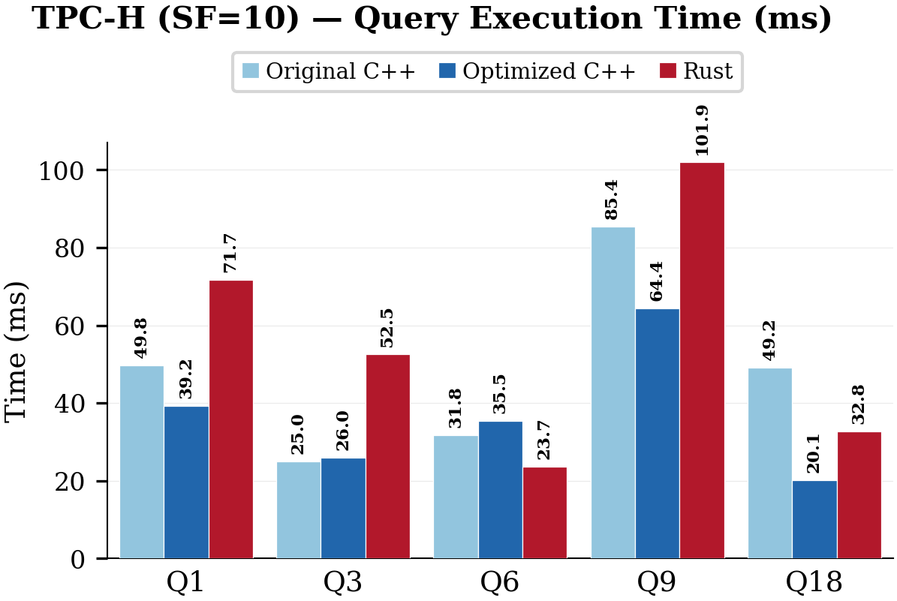

## Language Comparison: C++ vs Optimized C++ vs Rust

We compare three implementations of GenDB's generated query code on TPC-H (SF10): the **original C++** generated by GenDB, **optimized C++** refined by Claude Code (Opus 4.6), and a full **Rust** rewrite also by Claude Code (Opus 4.6). The process: select the best-performing C++ binary for each query from the GenDB run, then give Claude Code 5 iterations to analyze, profile, and improve each implementation — first for optimized C++ (aggressive compiler flags, madvise tuning, parallelized joins, thread count optimization), then for Rust (rayon parallelism, unsafe bounds-check elimination, memmap2 zero-copy I/O).

| | Original C++ | Optimized C++ | Rust |
|---|---|---|---|
| **Q1** | 49.8 ms | **39.2 ms** | 71.7 ms |
| **Q3** | **25.0 ms** | 26.0 ms | 52.5 ms |
| **Q6** | 31.8 ms | 35.5 ms | **23.7 ms** |
| **Q9** | 85.4 ms | **64.4 ms** | 101.9 ms |
| **Q18** | 49.2 ms | **20.1 ms** | 32.8 ms |
| **Total** | 241.2 ms | **185.2 ms** (1.30x) | 282.6 ms |

Optimized C++ achieves a **1.30x** speedup over the original, with Q18 showing the largest gain (2.44x) from parallelized join building. Rust wins on Q6 (zone-map scan with `get_unchecked`) but carries ~30ms per-query overhead from mmap page table setup, penalizing short queries. The Rust `main_scan` compute times are competitive with C++, suggesting the overhead is structural rather than algorithmic. We plan to introduce a dedicated **Code Refiner** agent to the pipeline, responsible for low-level, implementation-level optimizations — compiler flag tuning, memory access patterns, SIMD utilization, cross-language code generation — to automatically achieve these gains as part of the standard GenDB workflow.

Source code for all three implementations is available in [`output/deprecated/tpc-h/language-comparison/`](../output/deprecated/tpc-h/language-comparison/).
