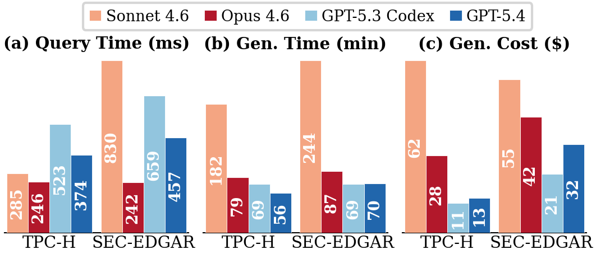

## Model Comparison

GenDB supports multiple LLM backbone models. Different models offer different trade-offs between generated code quality, generation time, and cost.

| | Opus 4.6 | Sonnet 4.6 | GPT-5.4 | GPT-5.3-Codex |
|---|---|---|---|---|
| **TPC-H** | **246 ms** | 285 ms | 374 ms | 523 ms |
| **SEC-EDGAR** | **242 ms** | 830 ms | 457 ms | 659 ms |
| **TPC-H Cost** | $27.98 | $62.46 | $12.61 | $10.79 |
| **SEC-EDGAR Cost** | $41.85 | $55.44 | $32.08 | $21.19 |
| **TPC-H Gen. Time** | 79 min | 182 min | 56 min | 69 min |
| **SEC-EDGAR Gen. Time** | 87 min | 244 min | 70 min | 69 min |

**Opus 4.6** achieves the best execution performance on both benchmarks. **GPT-5.3-Codex** offers the lowest generation cost. **GPT-5.4** provides a good balance between code quality and cost.

> **Note:** The original paper used Sonnet 4.6 for experiments. However, Sonnet 4.6 has recently become unstable — frequently overthinking or encountering internal errors, causing agents to hang until timeout. We recommend using **Opus 4.6** or **GPT-5.4** for now.

